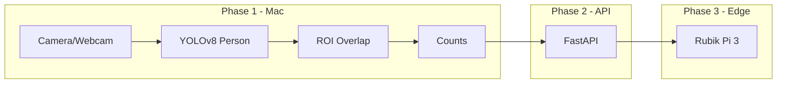

# RoomRadar Build Plan

Edge occupancy detection for study spaces: **camera → local inference → anonymous counts only** (no video leaves the device). FERPA-friendly, offline-capable, Mac-first then deploy to Rubik Pi 3.

## Tech Stack

| Layer          | Choice                                       | Notes                                      |
| -------------- | -------------------------------------------- | ------------------------------------------ |
| Language       | Python 3.10+                                 | Main dev and inference                     |
| CV / ML        | PyTorch, Ultralytics (YOLOv8), OpenCV, NumPy | Person detection + ROIs                    |
| API            | FastAPI + Uvicorn                            | Counts-only backend                        |
| Data           | SQLite or in-memory                          | Optional; occupancy history                |
| Export (later) | ONNX, ONNX Runtime                           | For Rubik Pi 3                             |
| Mobile (later) | React Native + Expo or Kotlin                | App consumes API                           |
| Edge (later)   | Rubik Pi 3 + Qualcomm SDK                    | Confirm SNPE vs QNN when you have hardware |

**Design choice:** Use **person detection + fixed ROIs** (zones per seat/desk), not a custom “seat” detector at first. Custom seat model can be a later phase.

---

## High-Level Flow



---

## Phase 1: Environment + Detection (Mac)

**Goal:** Webcam → YOLO person detection → print counts (no API yet).

- **1.1 Environment** — venv, `requirements.txt`, install deps.
- **1.2 Detection** — `detection/detect.py`: webcam or video, YOLOv8 person-only, bounding boxes.
- **1.3 ROI config** — `config/zones.json`: normalized zones per seat/area.
- **1.4 Occupancy** — `occupancy/seat_counter.py`: person-in-ROI → available/occupied per zone.

**Done when:** One script reads webcam/video, runs YOLO, applies ROIs, prints or logs counts per zone.

---

## Phase 2: Minimal API

**Goal:** Backend exposes counts only (no video, no PII).

- `GET /occupancy` → current counts per zone.
- Optional: in-memory or SQLite for history.
- Detection process POSTs or updates shared state.

**Done when:** `GET /occupancy` returns live counts; no video in API/DB.

---

## Phase 3: Mobile App (optional)

- App calls `GET /occupancy` (e.g. Mac LAN IP on Wi‑Fi).
- UI: zones with available/occupied or “X seats free.”

---

## Phase 4: Edge Deployment (Rubik Pi 3)

**Goal:** Same pipeline on device; only counts leave the node.

- Export YOLO to ONNX; verify with ONNX Runtime.
- Run on Rubik Pi 3 with Qualcomm SDK (SNPE or QNN per board docs).
- Camera + inference on device; POST counts only.

---

## Suggested Project Layout

```
RoomRadar/
├── venv/
├── requirements.txt
├── config/zones.json
├── detection/detect.py
├── occupancy/seat_counter.py
├── api/server.py
├── static/dashboard/
├── datasets/
└── scripts/
```

---

## Order of Work (checklist)

1. Repo structure + venv + `requirements.txt`
2. `detection/detect.py`
3. `config/zones.json` + `occupancy/seat_counter.py`
4. `api/server.py` + wire detection → API
5. (Optional) Mobile app
6. (Later) ONNX + Rubik Pi 3

---

## Risks / Open Points

- **Rubik Pi 3 SDK:** Confirm SNPE vs QNN when you have the board.
- **ROI definition:** Start with one camera and a few rectangles; refine with real footage.
- **Timeline:** Phase 1–2 are quick on Mac; mobile and edge depend on hardware and schedule.

---

*Copied from Cursor plan for local reference. Original may also live under `~/.cursor/plans/`.*
